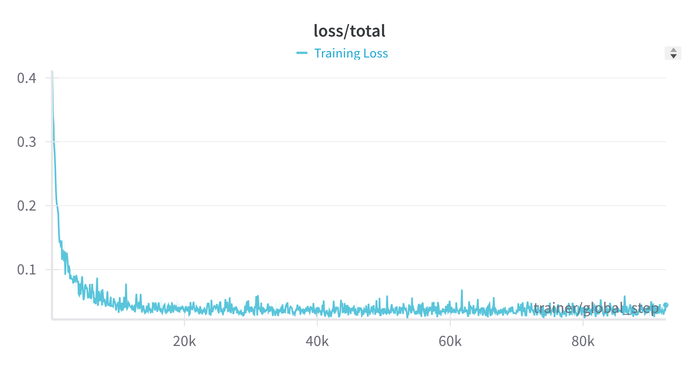

# Unofficial Implementation of GS-LRM

This is the code an unofficial implementation for **GS-LRM: Large Reconstruction Model for 3D Gaussian Splatting**.

Check out the official [project website here](https://sai-bi.github.io/project/gs-lrm/).

In this repository, we present a PyTorch implementation of GS-LRM, focusing specifically on the stage 1 training pipeline on scene-level datasets from the original paper. We welcome and encourage the community to extend this work by developing the stage 2 training process, inference pipeline, and evaluation frameworks based on our implementation.

## Installation

To get started, create a virtual environment using Python 3.10+:

```bash
conda create -n gs-lrm python=3.10
conda activate gs-lrm
# Install these first! We recommend using pytorch version==2.5.0 with cuda 12.4 by default.
pip install torch==2.5.0 torchvision==0.20.0 torchaudio==2.5.0 --index-url https://download.pytorch.org/whl/cu124
pip install -r requirements.txt
# We recommend using xformers==0.0.28.post2 to match the version of pytorch.
pip3 install -U xformers==0.0.28.post2 --index-url https://download.pytorch.org/whl/cu124
```

Install `diff-gaussian-rasterization` now, we recommend using a third party implementation to support depth rendering and backpropagation of gaussian rasterization:

```bash
mkdir submodules
cd submodules
git clone https://github.com/ashawkey/diff-gaussian-rasterization.git --recursive
cd diff-gaussian-rasterization
pip install -e .
```

## Acquiring Datasets

We follow the same data format as [pixelSplat](https://davidcharatan.com/pixelsplat/), which was trained using versions of the RealEstate10k dataset that were split into ~100 MB chunks for use on server cluster file systems. Small subsets of the Real Estate 10k datasets in this format can be found [here](https://drive.google.com/drive/folders/1joiezNCyQK2BvWMnfwHJpm2V77c7iYGe?usp=sharing). To use them, simply unzip them into a newly created `datasets` folder in the project root directory.

After downloading the dataset, please change the dataset path in the `config/dataset/re10k.yaml` and `config/experiment/re10k.yaml` file to your personal dataset path.

## Sanity Check: Training Diagnostics & Rendering Validation

### 1. Training Loss Dynamics



### 2. Rendering Quality Assessment


**Evaluation Set Fidelity Metrics**:
```python
PSNR: 28.42 dB       # Peak Signal-to-Noise Ratio
SSIM: 0.903         # Structural Similarity Index
LPIPS: 0.052       # Learned Perceptual Image Patch Similarity
```

Please note that the evaluation setting (resolution: 256x256, 2 context views, 4 target views) is not the same as the original paper setting, and we didn't conduct the evaluation on the full evaluation set, so the metrics are not directly comparable with the original paper.

## Running the Code

### Training

The main entry point is `src/main.py`. Call it via:

```bash
python3 -m src.main +experiment=re10k
```

This configuration requires a single GPU with 80 GB of VRAM (A100 or H100). To reduce memory usage, you can change the batch size as follows:

```bash
python3 -m src.main +experiment=re10k data_loader.train.batch_size=1
```

Our code supports multi-GPU training. The above batch size is the per-GPU batch size.


## Acknowledgements

We extend our sincere gratitude to the following research teams and open-source projects that have contributed foundational elements to this work:

### Codebase Acknowledgement
1. ​**pixelSplat: 3D Gaussian Splats from Image Pairs for Scalable Generalizable 3D Reconstruction**  
   - ​**Contributors**: [David Charatan](https://davidcharatan.com/#/) et al.  
   - ​**References**: [Project Page](https://davidcharatan.com/pixelsplat/) | [Code Repository](https://github.com/dcharatan/pixelsplat)  
   - ​**Technical Support**:  
     - Our implementation framework is built upon the pixelSplat architecture  
     - Inherited compatibility with its data formatting conventions and training pipeline  
     - Special recognition for the innovative code architecture design

2. ​**Long-LRM Self-Reimplementation**  
   - ​**Maintainers**: [Arthur Hero](https://github.com/arthurhero)  
   - ​**References**: [Code Repository](https://github.com/arthurhero/Long-LRM)  
   - ​**Technical Adoption**:  
     - Integrated core model implementation schemes from this repository  
     - Adapted key modules for neural rendering optimization  
     - Appreciation for maintaining code accessibility and documentation completeness

### Special Recognition
We particularly acknowledge the open-source community's invaluable contributions in advancing 3D reconstruction research. The transparency and extensibility demonstrated in these projects have significantly accelerated our development process.


